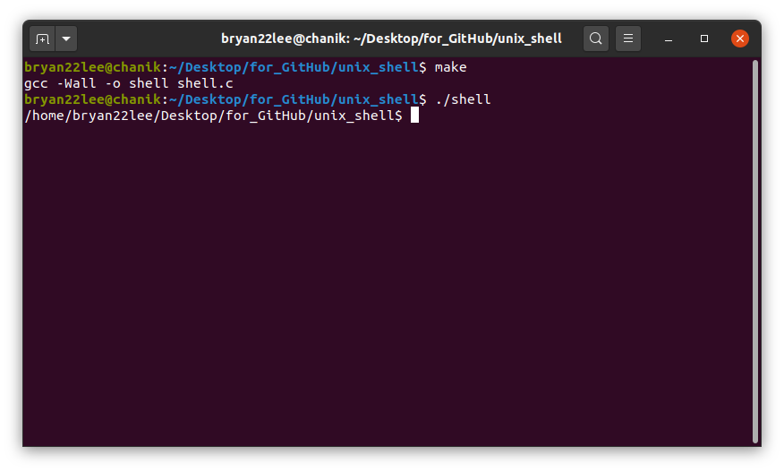

# Unix Shell Project

## Implement simplified version of Unix Shell
## (command-line interface)

#### Chanik Bryan Lee

## Files
  - `shell.c`: Source code
  - `Makefile`: To compile the executable
  - `README.md`: This file

## To create the executable
  - `make`, `make all`, or `make shell` builds the executable `shell`
  - `./shell` runs the executable inside the parent shell. This is my implementation of the
    Unix Shell. The prompt ends with `$` and takes commands
  - Exit the shell with the `exit` command
  - Remove the executable with `make clean`

### My shell in action (command prompt):
